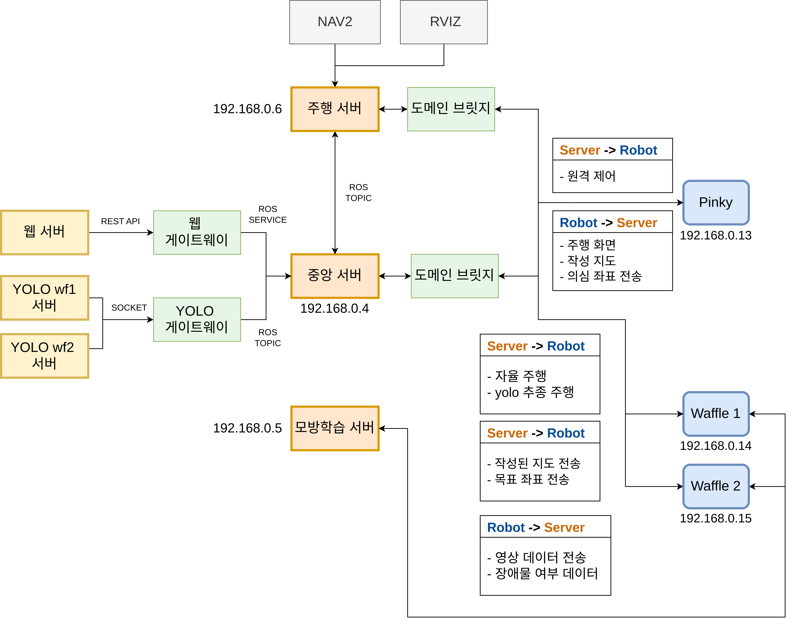
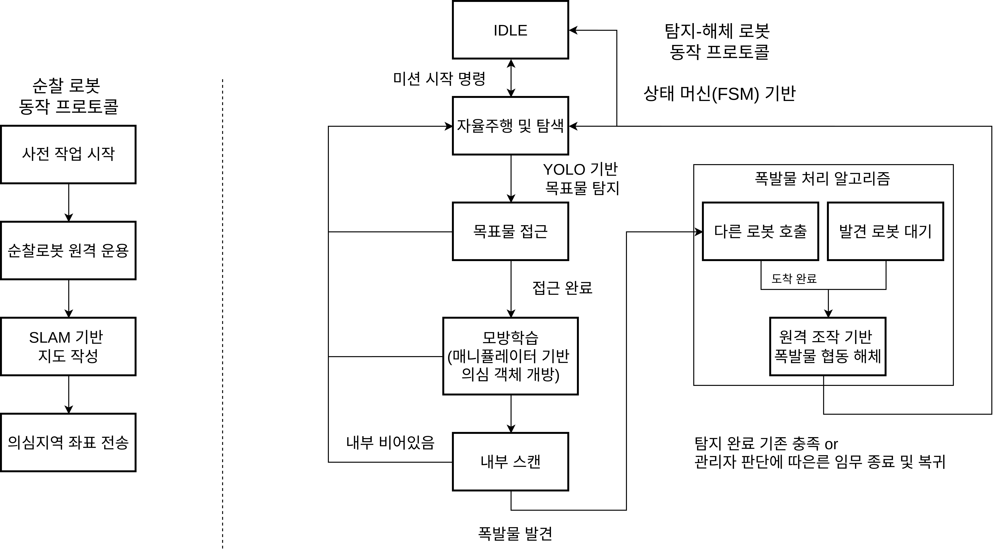

<div align="center">


<br>

[](https://docs.ros.org/en/jazzy/)
[](https://python.org)
[](https://pytorch.org)
[](https://flask.palletsprojects.com)
[](https://opencv.org)

<br>

> **순찰 로봇이 폭발물을 탐지하고, 해체 로봇이 자율 접근 후 원격으로 해체합니다.**  
> 사람이 위험 지역에 들어가지 않아도 되는 다중 로봇 EOD 시스템입니다.

</div>

<br>

---

## 📌 개발 배경 및 목적

<br>

<div align="center">

### 🌍 글로벌 폭발물 피해 현황 (2023)

<table>
<tr>
<td align="center" width="33%">
<h2>47,000<sup>+</sup></h2>
연간 전 세계 폭발물 사상자
</td>
<td align="center" width="33%">
<h2>72%</h2>
사상자 중 민간인 비율
</td>
<td align="center" width="33%">
<h2>30세</h2>
EOD 요원 평균 사망 연령
</td>
</tr>
</table>

</div>

<br>

<table>
<tr>
<td width="50%" valign="top">

### ⚠️ EOD 요원이 처한 현실

- 임무 후 극심한 PTSD로 인한 **자살률, 일반 병사 대비 2배**
- 직업성 사망률 일반 직군 대비 **+164% (2.6배)**
- 인력을 현장에 직접 투입하는 방식은 **구조적 한계**에 봉착

</td>
<td width="50%" valign="top">

### 🚧 기존 기술의 한계

- 드론(UAV), GPR 등 **탐지 기술은 발전** 중
- 그러나 발견 후 **안전하게 해체하는 정밀 로봇 기술은 공백**
- 2D 카메라 의존으로 작업자가 **입체감·거리감을 상실**

</td>
</tr>
</table>

<br>

<div align="center">

### 💡 이 프로젝트의 목표

| | 목표 | 방법 |
|:---:|:---|:---|
| 🔍 | 실시간 위험물 자동 인식 및 시각화 | YOLO 기반 비전 시스템 |
| 🦾 | 작업자 없이 원격 정밀 해체 | 다관절 매니퓰레이터 직관적 연동 제어 |
| 🤖 | 다중 로봇 자율 협업 | ROS2 기반 탐색·해체 로봇 분업 구조 |
| 🧠 | 미등록 위협 상황 판단 및 대응 | RAG + LLM 의사결정 모듈 |

</div>

<br>

---

## 🎬 시나리오

<br>

```
 ┌──────────────────────────────────────────────────────────────────────┐
 │                                                                      │
 │   STEP 1  🔎  순찰                                                   │
 │   ──────────────────────────────────────────────────────────────     │
 │   Pinky(순찰 로봇)가 LiDAR + SLAM으로 실시간 지도를 생성                │
 │                                                                      │
 │                                                                      │
 │                              │                                       │
 │                              ▼                                       │
 │                                                                      │
 │   STEP 2  🚗  접근                                                   │
 │   ──────────────────────────────────────────────────────────────     │
 │   wf1/wf2(해체 로봇)가 YOLO를 통해 폭발물 상자를 자율 탐색 및 접근       │
 │                                                                      │
 │                                                                      │
 │                              │                                       │
 │                              ▼                                       │
 │                                                                      │
 │   STEP 3  🦾  개방 및 확인                                           │
 │   ──────────────────────────────────────────────────────────────     │
 │   모방학습으로 학습된 로봇팔이 상자 개방                                │
 │   상자 내부를 YOLO로 탐지해 폭발물 여부 및 종류 판단                    │
 │                                                                      │
 │                              │                                       │
 │                              ▼                                       │
 │                                                                      │
 │   STEP 4  🧠  판단                                                   │
 │   ──────────────────────────────────────────────────────────────     │
 │   RAG + LLM이 폭발물 등록 여부를 판단                                  │
 │   등록된 경우 해체 절차를 안내                                         │
 │   미등록인 경우 수통 보고를 자동 생성하고 접근 제한 조치                 │
 │                                                                      │
 │                              │                                       │
 │                              ▼                                       │
 │                                                                      │
 │   STEP 5  🎮  수동 원격 해체                                         │
 │   ──────────────────────────────────────────────────────────────     │
 │   운용자가 Web UI를 통해 원격으로 매니퓰레이터를 정밀 제어               │
 │   안전하게 폭발물을 해체                                               │
 │                                                                      │
 └──────────────────────────────────────────────────────────────────────┘
```

<br>

---

## 🏆 핵심 성과

<div align="center">

| 항목 | 결과 |
|:---|:---|
| 🎯 폭발물 탐지 정확도 (YOLOv26m) | mAP50-95 **95.21%** / Recall **99.71%** / Precision **99.91%** |
| ⚡ 모방학습 추론 지연시간 | **5~10ms**, 영상 전송 **30FPS** 안정 |
| 🤖 다중 로봇 동시 운용 | ROS Domain Bridge로 3종 로봇 충돌 없이 협업 |
| 🧠 미등록 폭발물 대응 | RAG-LLM이 수통 보고 자동 생성 및 접근 제한 조치 안내 |

</div>

<br>

---

## 🏗️ 시스템 아키텍처



---




**ROS Domain 분리 구조**

```
  DOMAIN 13 │ Pinky      → SLAM 지도 생성 및 공유
  DOMAIN 10 │ 주행 서버  → 좌표 DB 관리 / 로봇 명령 분배 (Dispatcher)
  DOMAIN 14 │ wf1        → Nav2 자율 주행 / 폭발물 해체
  DOMAIN 15 │ wf2        → Nav2 자율 주행 / 폭발물 해체
```

<br>

---

## 🛠️ 기술 스택

<div align="center">

**Robotics & Middleware**


**AI / Vision**


**Hardware**


**Backend / Frontend**


</div>

<br>

---

## 🔬 주요 기술 상세

<br>

### 🤖 ROS2 기반 다중 로봇 자율 주행

> Pinky가 실시간으로 맵을 생성하고, 주행 서버가 wf1/wf2의 위치와 목표 좌표를 관리하여 가장 적합한 로봇에게 주행 목표를 배정합니다.

본 프로젝트는 3대의 로봇을 안정적으로 동시에 운용하기 위해 각 로봇과 PC를 서로 다른 `ROS_DOMAIN_ID`로 분리했습니다.
Pinky는 SLAM을 통해 실시간 `/map`을 생성하고, 주행 서버는 Domain Bridge를 통해 Pinky의 맵과 wf1/wf2의 위치 정보를 수신합니다.

```
Pinky  → 실시간 SLAM map 생성
PC     → 좌표 DB 저장 / 목표 배정 / start·stop 명령 처리
wf1/2  → Nav2 기반 목표 좌표 자율 주행
```

주행 서버는 사용자가 지정한 publish point와 랜덤 좌표를 DB에 저장하고, wf1/wf2의 `/amcl_pose`를 기준으로 가장 가까운 로봇에게 목표를 배정합니다.
목표 좌표는 `/goal_pose`를 통해 전달되며, 로봇 내부에서는 이를 Nav2의 `/navigate_to_pose` action으로 변환하여 주행을 수행합니다.

또한 중앙 서버의 `start / stop` 명령에 따라 로봇별 상태를 `STOPPED`, `IDLE`, `NAVIGATING`으로 관리합니다.
`stop` 명령 시에는 `/cmd_vel`에 0 속도를 반복 발행하지 않고, 현재 수행 중인 Nav2 goal을 cancel하여 주행을 중단하도록 구현했습니다. 이를 통해 외부 주행 명령과 정지 명령이 중첩되는 문제를 줄이고, 주행 제어 흐름을 명확하게 정리했습니다.

<br>

### 🎯 YOLO 기반 실시간 폭발물 탐지

> 세 가지 모델을 직접 학습하고 비교해 최종 모델을 선정했습니다.

<div align="center">

| Model | mAP50-95 | Recall | Precision |
|:---:|:---:|:---:|:---:|
| YOLOv10m | 93.9% | 99.66% | 99.64% |
| YOLOv11m | 94.11% | 99.71% | 99.89% |
| **✅ YOLOv26m** | **95.21%** | **99.71%** | **99.91%** |

</div>

```
탐지 확정 조건  →  신뢰도(conf) ≥ 0.80  +  2초 이상 유지
```

<br>

---

### 🦾 모방학습 기반 로봇팔 제어

> 운용자가 리더암을 조작하면 팔로워암이 동작을 따라하며, 이 과정에서 수집한 데이터로 **자율 Box Open**을 구현했습니다.

<table>
<tr>
<td width="50%" valign="top">

**📦 Box Open 동작 순서**

```
① 상자·손잡이가 카메라에 최대 포함되도록 초기 위치 조정
② 손잡이가 명확히 보이도록 매니퓰레이터 하강
③ 안정적 파지를 위해 엔드이펙터 좌우 위치 조정
④ 손잡이 방향으로 진입 가능하도록 벌림 각도 조정
⑤ 가능 거리까지 전진 후 손잡이 파지 실행
⑥ 모터 과부하 방지를 위해 상승 후 Box Open
⑦ 지정 위치로 이동 후 엔드이펙터 하향 조정
⑧ 파지 해제 후 초기 상태로 복귀
```

</td>
<td width="50%" valign="top">

**💪 강건성 향상 전략**

| 기법 | 설명 |
|:---:|:---|
| **Domain<br>Randomization** | 조명·배경·색상·센서 노이즈 무작위화 |
| **State<br>Perturbation** | Sub-optimal 상태에서 복구 데이터 수집 |
| **DAgger** | 실수 유도 후 난처한 상황 대처 데이터 추가 수집 |

</td>
</tr>
</table>

**🔗 추론 통신 구조**

```
[cam_1 / cam_2] ──영상 + 관절 각도──▶ [Raspberry Pi] ──네트워크──▶ [PC 추론 서버]
                                                                          │
                                  관절 각도 제어 명령 ◀────────────────────┘

  지연시간 5~10ms  │  영상 전송 30FPS  │  실시간 추론 안정
```

<br>

---

### 🧠 RAG + LLM 의사결정

```
  YOLO 탐지 결과 수신
  (conf ≥ 0.80, 2초 유지)
          │
          ▼
  ┌───────────────┐       YES      ┌──────────────────────────┐
  │ 등록된 폭발물? │ ─────────────▶ │ 해체 절차 안내           │
  │ Bomb_A / B   │                │ (단계별 해체 방법 제공)   │
  └───────────────┘                └──────────────────────────┘
          │ NO
          ▼
  ┌──────────────────────────────────────┐
  │ 수통 보고 자동 생성                   │
  │  ├─ 현재 조치 즉시 중단              │
  │  ├─ 안전 구역으로 이송               │
  │  ├─ 주변 접근 제한                   │
  │  └─ 관리자 확인 요청                 │
  └──────────────────────────────────────┘
```

<br>

---

### 🔧 다중 로봇 자율 주행 — 트러블슈팅

> 개발 중 가장 많은 시간을 투자한 문제는 **3대 로봇 동시 운용**이었습니다.

<details>
<summary><b>📋 자세한 트러블슈팅 내용 펼쳐보기</b></summary>

<br>

## 🔧 Troubleshooting: Multi-Robot ROS2 Network 구조 변경

### 1. 동일한 ROS_DOMAIN_ID + Namespace 방식을 시도한 이유

초기에는 Pinky, WF1, WF2, PC의 `ROS_DOMAIN_ID`를 모두 동일하게 설정하고, 각 로봇을 `namespace`로 구분하는 방식을 시도하였습니다.

이 방식은 모든 로봇과 PC가 하나의 ROS2 네트워크 안에서 바로 통신할 수 있기 때문에 `/map`, `/clicked_point`, `/goal_pose`, `/amcl_pose` 등의 토픽을 별도의 브릿지 없이 공유할 수 있다는 장점이 있었습니다. 또한 RViz나 CLI에서 전체 노드와 토픽을 한 번에 확인할 수 있어 구조가 단순해 보였습니다.

하지만 실제 다중 로봇 Nav2 환경에서는 단순히 namespace만 적용하는 방식으로는 안정적인 분리가 어렵다는 문제가 있었습니다.

---

### 2. Namespace 사용 시 가장 큰 문제

가장 큰 문제는 **TF frame과 Nav2 파라미터가 namespace와 함께 일관되게 적용되지 않는 문제**였습니다.

ROS2 topic은 namespace로 구분할 수 있지만, `map`, `odom`, `base_footprint`, `base_link`, `base_scan`과 같은 TF frame 이름은 메시지 내부의 frame 값으로 사용되기 때문에 namespace가 자동으로 안전하게 분리되지 않았습니다.

그 결과 다음과 같은 문제가 발생하였습니다.

* `map -> odom -> base_footprint -> base_link` TF 연결이 로봇별로 명확히 분리되지 않았습니다.
* prefix가 중복 적용되거나 frame 이름이 맞지 않아 AMCL localization이 실패하였습니다.
* Nav2 YAML 파라미터에서 `map_topic`, `odom_frame`, `base_frame` 등이 의도와 다르게 적용되었습니다.
* `/map`을 구독해야 하는 AMCL이나 costmap이 잘못된 토픽 또는 frame을 참조하였습니다.

즉, namespace는 topic 이름을 분리하는 데에는 유용했지만, 다중 로봇의 TF와 Nav2 localization 구조까지 안정적으로 분리하기에는 한계가 있었습니다.

---

### 3. 최종 구조: Domain ID 분리 + Domain Bridge 사용

최종적으로는 각 로봇과 PC의 `ROS_DOMAIN_ID`를 분리하고, 필요한 토픽만 `domain_bridge`로 연결하는 방식으로 변경하였습니다.

| Device | ROS_DOMAIN_ID |
| ------ | ------------- |
| PC     | 10            |
| Pinky  | 13            |
| WF1    | 14            |
| WF2    | 15            |

이 구조에서는 각 로봇이 독립적인 ROS2 네트워크에서 Nav2를 실행하고, PC는 필요한 데이터만 선택적으로 bridge합니다.

예를 들어 Pinky가 생성한 실시간 `/map`은 PC를 거쳐 WF1, WF2로 전달하고, WF1/WF2의 `/amcl_pose`는 다시 PC로 전달합니다. 또한 PC에서 계산한 목표 좌표는 `/wf1/goal_pose`, `/wf2/goal_pose` 형태로 각 로봇에게 전달됩니다.

이 방식으로 변경하면서 각 로봇의 TF, Nav2, AMCL, cmd_vel 구조가 서로 섞이지 않게 되었고, 다중 로봇 환경을 더 안정적으로 관리할 수 있었습니다.

---

### 4. Domain Bridge 적용 이후 주요 트러블슈팅

Domain Bridge 적용 이후 가장 중요했던 문제는 **지도(`/map`) 공유와 AMCL localization 구조 충돌**이었습니다.

Pinky는 SLAM을 통해 실시간 `/map`을 생성하고 있었고, WF1/WF2는 이 맵을 받아서 AMCL과 Nav2 costmap에서 사용해야 했습니다. 하지만 초기에는 WF1/WF2에서도 Nav2의 `map_server`가 함께 실행되어 Pinky의 `/map`과 로봇 내부의 `/map`이 동시에 존재하는 문제가 발생하였습니다.

이로 인해 AMCL과 costmap이 어떤 `/map`을 기준으로 동작하는지 불명확해졌고, localization이 불안정해졌습니다.

해결 방법은 다음과 같습니다.

* WF1/WF2에서는 `map_server`를 실행하지 않도록 수정하였습니다.
* Pinky의 SLAM `/map`만 유일한 map source로 사용하도록 하였습니다.
* PC에서 domain bridge를 통해 Pinky의 `/map`, `/map_metadata`를 WF1/WF2 도메인으로 전달하였습니다.
* WF1/WF2의 AMCL과 Nav2 costmap이 bridged `/map`을 구독하도록 설정하였습니다.
* `map_topic`을 상대 경로가 아닌 절대 경로 `/map` 기준으로 정리하였습니다.

결과적으로 Pinky가 생성한 실시간 맵을 WF1/WF2가 공유하고, 각 로봇은 독립적인 도메인 안에서 AMCL localization과 Nav2 주행을 수행하는 구조로 안정화할 수 있었습니다.

</details>

<br>

---

## 🚀 설치 및 실행

**의존성 설치**

```bash
pip install torch torchvision opencv-python flask ultralytics
sudo apt install ros-humble-navigation2 ros-humble-nav2-bringup ros-humble-slam-toolbox
```

**실행 순서**

```bash
# ① Pinky SLAM
ROS_DOMAIN_ID=13 ros2 launch pinky_slam slam_launch.py

# ② 주행 서버
ROS_DOMAIN_ID=10 python3 dispatcher_server.py

# ③ 해체 로봇 Nav2
ROS_DOMAIN_ID=14 ros2 launch waffle_nav2 nav2_launch.py robot_name:=wf1
ROS_DOMAIN_ID=15 ros2 launch waffle_nav2 nav2_launch.py robot_name:=wf2

# ④ YOLO 탐지 서버
python3 yolo_detection_server.py

# ⑤ Web UI
python3 app.py

# ⑥ 모방학습 추론
python3 imitation_inference_server.py
```

<br>

---

## 📁 디렉토리 구조

```
📦 eod-bot
 ┣ 📂 patrol_robot/       # Pinky SLAM 패키지
 ┣ 📂 disposal_robot/     # wf1/wf2 Nav2 + 매니퓰레이터 제어
 ┣ 📂 dispatcher_server/  # 좌표 DB 및 로봇 명령 분배
 ┣ 📂 ai_perception/      # YOLOv26m 학습 및 추론
 ┣ 📂 imitation_learning/ # 모방학습 데이터 수집·학습·추론
 ┣ 📂 llm_rag/            # RAG + LLM 의사결정 모듈
 ┣ 📂 web_server/         # Flask + 프론트엔드 UI
 ┣ 📂 domain_bridge/      # ROS Domain Bridge 설정
 ┗ 📜 README.md
```

<br>

---

<div align="center">

한화 로보틱스 & ROBOTIS AI 융합 로봇 SW 개발자 과정 2기


</div>
